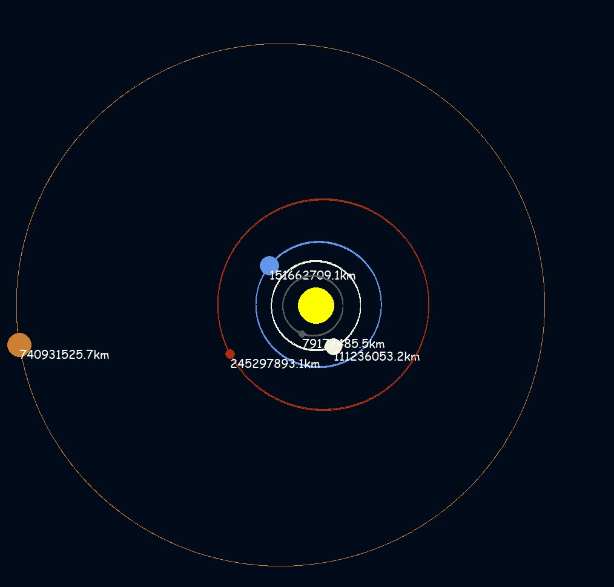
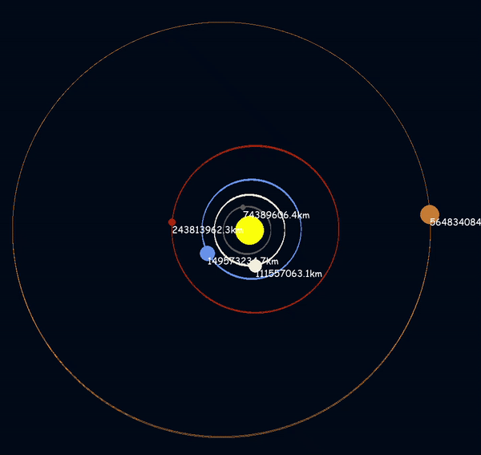

# Planetary Orbit Simulation in Python with Pygame

Experience the captivating motion of planets with this realistic planetary orbit simulation built using Python and the Pygame library. Witness the intricate gravitational dynamics of our solar system and gain insights into the wonders of planetary motion.

## Table of Contents

- [Demo](#demo)
- [Features](#features)
- [Installation](#installation)
- [Usage](#usage)
- [Contributing](#contributing)
- [License](#license)

## Demo

Check out a [live demo](https://yourdemo.link) to experience the simulation in action.

## Features

- **Realistic Astronomy:** Utilizes accurate astronomical data for planet sizes, distances, and orbital velocities, offering an authentic representation of our solar system.
- **Gravitational Physics:** Implements physics calculations to simulate gravitational forces between planets, resulting in accurate orbits and interactions.
- **Educational:** Learn about the complex dynamics that govern planetary motion while enjoying an immersive experience.
- **Visually Stunning:** Planet textures, and orbital paths contribute to a captivating visual representation.
- **Efficient:** Optimized and synchronized code ensures smooth performance, even on less powerful hardware.

## Installation

1. Ensure you have Python 3 installed.
2. Clone this repository: `git clone https://github.com/yourusername/planetary-orbit-simulation.git`
3. Navigate to the project directory: `cd planetary-orbit-simulation`
4. Install the required dependencies: `pip install pygame`

## Usage

Run the simulation: `python main.py`

Feel free to [get in touch](mailto:akshatdixit2017@gmail.com) if you have any questions or suggestions. Happy exploring the mysteries of our solar system!
